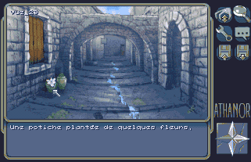
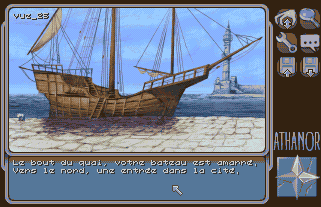

# R-PAGE
## Resistance's Portable-Adventure-Game-Engine

**R-PAGE** (pronounced 'arpège') is a **C framework** meant to accelerate the creation of **adventure games** for the Amiga OCS/ECS range of computers. It is designed with portability in mind, speed performance being a lesser concern. 
R-PAGE is brought to you by the **demoscene** group known as [RESISTANCE](https://www.pouet.net/groups.php?which=1572&order=release).

* Written in C language
* AmigaOS & OS-friendly for all the access to the Amiga hardware
* Portable code, builds on SAS/C
* Reportedly works on MorphOS using the built-in AmigaOS emulation layer
* AMIGA OCS/ECS only (AGA is on the roadmap)

### Actual games based on R-PAGE:
* Athanor 2 by www.safargames.com
* ShuffleP\*ck adventures (work in progress title)
* Next adventure game by www.safargames.com

### 3rd party softwares included in R-PAGE:
* [tinfl.c](https://github.com/richgel999/miniz) (Zlib compression/decompression) by Richard Geldreich
* [Shrinkler](https://github.com/askeksa/Shrinkler) 68k ASM decompression routine by Aske Simon Christensen
* [Doynamite](https://github.com/AxisOxy/Planet-Rocklobster) 68k ASM decompression routine by Oxyron
* [ptreplay.library](http://aminet.net/package/mus/play/ptreplay66) ProTracker replay library by Mattias Karlsson and Andreas
Palsson

## License/Contact
R-PAGE is released under the MIT License. See [license.txt](license.txt). 
Reach us on Twitter [@RESISTANCE_NO](https://twitter.com/RESISTANCE_NO) or WWW [RESISTANCE HQ](https://resistance.no/)

## Sample screenshots

